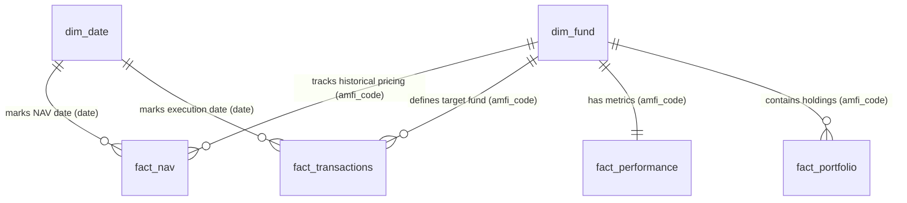

# Bluestock MF Capstone — Data Dictionary

**Version:** Day 2  
**Database:** bluestock_mf.db (SQLite)  
**Total Tables:** 8  
**Total Rows (approx.):** 87,543 source rows + dim_date generated rows  

---

## dim_fund
| Column | Type | Description | Example |
|--------|------|-------------|---------|
| amfi_code | INTEGER (PK) | AMFI unique scheme identifier | 119551 |
| fund_house | TEXT (NOT NULL) | Asset Management Company (AMC) name | SBI Mutual Fund |
| scheme_name | TEXT (NOT NULL) | Name of the mutual fund scheme | SBI Bluechip Fund - Direct Plan - Growth |
| category | TEXT (NOT NULL) | Broad asset class category | Equity |
| sub_category | TEXT | Granular category class | Large Cap |
| plan | TEXT | Plan type (Direct or Regular) | Direct |
| launch_date | DATE | Scheme launch date | 2006-02-14 |
| benchmark | TEXT | Reference index name | NIFTY 100 TRI |
| expense_ratio_pct | REAL | Scheme expense ratio percentage | 0.66 |
| exit_load_pct | REAL | Exit load penalty percentage | 1.00 |
| min_sip_amount | INTEGER | Minimum systematic investment plan amount | 500 |
| min_lumpsum_amount | INTEGER | Minimum one-time lumpsum investment amount | 5000 |
| fund_manager | TEXT | Name of the fund manager | Sohini Andani |
| risk_category | TEXT | Qualitative scheme risk profile rating | Very High |
| sebi_category_code | TEXT | SEBI standard categorization code | EQ_LC |

---

## dim_date
| Column | Type | Description | Example |
|--------|------|-------------|---------|
| date_id | INTEGER (PK) | Date surrogate key (autoincrement) | 123 |
| date | DATE (UNIQUE, NOT NULL) | Date value | 2025-01-01 |
| year | INTEGER | Calendar year | 2025 |
| month | INTEGER | Calendar month number (1–12) | 1 |
| quarter | INTEGER | Calendar quarter number (1–4) | 1 |
| month_name | TEXT | Name of the month | January |
| is_weekday | INTEGER | Weekday flag (1 = Mon-Fri, 0 = Sat-Sun) | 1 |

---

## fact_nav
| Column | Type | Description | Example |
|--------|------|-------------|---------|
| amfi_code | INTEGER (PK, FK) | AMFI unique scheme identifier (FK -> dim_fund) | 119551 |
| nav_date | DATE (PK) | Business date of Net Asset Value | 2025-01-01 |
| nav | REAL (NOT NULL) | Net Asset Value per unit (CHECK > 0) | 86.4251 |
| daily_return_pct | REAL | Percentage change from previous business day | 0.452 |

---

## fact_transactions
| Column | Type | Description | Example |
|--------|------|-------------|---------|
| tx_id | INTEGER (PK) | Transaction surrogate ID (autoincrement) | 1 |
| investor_id | TEXT (NOT NULL) | Anonymized unique investor identifier | INV_00001 |
| amfi_code | INTEGER (FK) | AMFI unique scheme identifier (FK -> dim_fund) | 119551 |
| transaction_date | DATE (NOT NULL) | Execution date of the transaction | 2025-01-03 |
| transaction_type | TEXT (NOT NULL) | Mode of transaction (CHECK: 'SIP', 'Lumpsum', 'Redemption') | SIP |
| amount_inr | INTEGER (NOT NULL) | Transaction amount in Indian Rupees (CHECK > 0) | 5000 |
| state | TEXT | State location of the investor | Maharashtra |
| city | TEXT | City location of the investor | Mumbai |
| city_tier | TEXT | Tier classification of investor location (CHECK: 'T30', 'B30') | T30 |
| age_group | TEXT | Age bracket classification | 26-35 |
| gender | TEXT | Gender of the investor | Male |
| annual_income_lakh | REAL | Annual income of the investor in Lakh Rupees | 12.5 |
| payment_mode | TEXT | Mode of transaction payment | Netbanking |
| kyc_status | TEXT | Investor KYC verification status (CHECK: 'Verified', 'Pending') | Verified |

---

## fact_performance
| Column | Type | Description | Example |
|--------|------|-------------|---------|
| amfi_code | INTEGER (PK, FK) | AMFI unique scheme identifier (FK -> dim_fund) | 119551 |
| scheme_name | TEXT | Scheme name | SBI Bluechip Fund - Direct Plan - Growth |
| fund_house | TEXT | Asset Management Company (AMC) name | SBI Mutual Fund |
| category | TEXT | Category name | Large Cap |
| plan | TEXT | Plan type | Direct |
| return_1yr_pct | REAL | 1-Year annualized return percentage | 18.52 |
| return_3yr_pct | REAL | 3-Year annualized return percentage | 15.31 |
| return_5yr_pct | REAL | 5-Year annualized return percentage | 14.12 |
| benchmark_3yr_pct | REAL | Benchmark index 3-Year return percentage | 14.80 |
| alpha | REAL | Jensen's Alpha (excess risk-adjusted returns) | 1.25 |
| beta | REAL | Beta coefficient (systematic risk indicator) | 0.92 |
| sharpe_ratio | REAL | Sharpe ratio (reward-to-volatility indicator) | 1.15 |
| sortino_ratio | REAL | Sortino ratio (reward-to-downside risk indicator) | 1.45 |
| std_dev_ann_pct | REAL | Annualized standard deviation of returns | 12.80 |
| max_drawdown_pct | REAL | Maximum peak-to-trough decline percentage | -8.54 |
| aum_crore | REAL | Total Assets Under Management in Crores | 35420.50 |
| expense_ratio_pct | REAL | Scheme expense ratio percentage | 0.66 |
| morningstar_rating | INTEGER | Morningstar rating score (1 to 5 stars) | 4 |
| risk_grade | TEXT | Risk classification grade | Above Average |

---

## fact_portfolio
| Column | Type | Description | Example |
|--------|------|-------------|---------|
| amfi_code | INTEGER (PK, FK) | AMFI unique scheme identifier (FK -> dim_fund) | 119551 |
| stock_symbol | TEXT (PK) | Underlying equity stock ticker symbol | RELIANCE |
| stock_name | TEXT | Name of the underlying holding company | Reliance Industries Ltd |
| sector | TEXT | Economic sector of holding company | Energy |
| weight_pct | REAL | Weight allocation of stock in the scheme portfolio | 8.42 |
| market_value_cr | REAL | Market value of stock holding in Crore Rupees | 2982.50 |
| current_price_inr | REAL | Trading price of stock in Indian Rupees | 2450.50 |
| portfolio_date | DATE (PK) | Report date of holding portfolio | 2025-01-31 |

---

## fact_aum
| Column | Type | Description | Example |
|--------|------|-------------|---------|
| date | DATE (PK) | Report end-date | 2025-03-31 |
| fund_house | TEXT (PK) | Asset Management Company name | SBI Mutual Fund |
| aum_lakh_crore | REAL | AUM in Lakh Crore Rupees | 6.05 |
| aum_crore | REAL | AUM in Crore Rupees | 605000.00 |
| num_schemes | INTEGER | Number of operational schemes | 120 |

---

## fact_sip_industry
| Column | Type | Description | Example |
|--------|------|-------------|---------|
| month | TEXT (PK) | Reporting month in format (YYYY-MM) | 2025-01 |
| sip_inflow_crore | REAL | Total monthly industry SIP contribution in Crores | 26400.00 |
| active_sip_accounts_crore | REAL | Count of active SIP accounts in Crores | 8.22 |
| new_sip_accounts_lakh | REAL | Count of newly registered SIP accounts in Lakhs | 9.10 |
| sip_aum_lakh_crore | REAL | Total mutual fund AUM accumulated via SIPs in Lakh Crores | 13.00 |
| yoy_growth_pct | REAL | Inflow growth percentage compared to 12 months prior | 40.14 |

---

## Relationships Diagram

